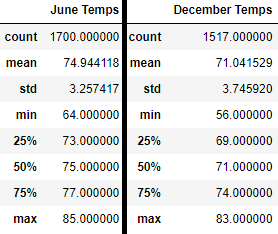

# Temperature Trends Using SQLAlchemy
## Overview
For the purpose of potentially opening a shop, the temperatures for the month of June and the month of December over about a decade have been extracted from the data. Looking at the statistics of both months, which include details such as the maximum temperature, the minimum temperature, the average temperature, and the standard deviation, an analysis will be done to see how the temperature may impact opening the surf shop.

## Results
- Between 2010 and 2016, June had 1,700 recorded temperatures while December had 1,517 recorded temperatures. This means that June has more data to work with, which has the potential to impact how we read and compare our results between the two.

- There is a 3 degree difference between the average temperatures of the two months, and a 2 degree difference between the highest recorded temperatures. However, there is an 8 degree difference between the lowest recorded temperatures.

- Regardless of how much of a drop is present, December's statistics are lower than June's in every measure except the standard deviation, which is roughly 0.5 degrees higher.

An image with the stats side-by-side has been added below for comparison.

## Summary
On the face, there is not a great deal of difference between the months of June and December in Oahu. As such, a surf and ice cream shop business should be sustainable all year round. However, considering just how close the results are, a closer look at the temperature, and weather as whole, in these months is warranted.

I would want to see this same data for these months separated by year, so that we can see if the weather has been getting hotter or cooler as the years pass. We could also see if the invidual years mimic the trend of the full data. To do this, all that is needed is to add ` .filter(extract("year", Measurement.date) == year)` to the code already there. A graph could be made with this data, which might prove very useful.

Something else worth looking at in the data is a full month of June and December, perhaps the most recent year or a couple random years. We just need to import datetime, choose June or December 1st, and then set the days to 30 or 31 respectively to extract all the days. This way we can see how consistent the temperature is on a day to day basis in these months.

